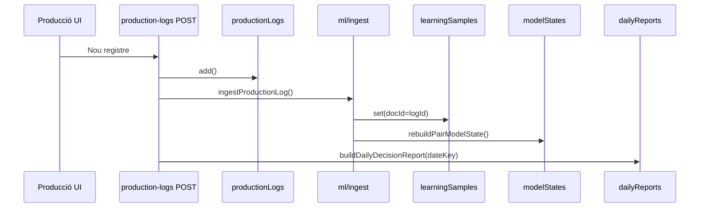

# Cuina central — Arquitectura tècnica

**Versió:** 1.0  
**Stack:** Next.js 15 (App Router) · Firestore · NextAuth  
**Patró:** Mòdul vertical amb domini a `lib/`, APIs a `app/api/`, UI a `app/menu/`

---

## 1. Visió general

```
src/
├── lib/cuina-central/           # Domini i lògica de negoci
│   ├── collections.ts           # Noms de col·leccions Firestore
│   ├── types.ts                 # Tipus TypeScript compartits
│   ├── auth.ts                  # requireCuinaCentralAdmin()
│   ├── utils.ts                 # Normalització, dates, mediana
│   ├── firestoreMappers.ts      # Doc Firestore → tipus domini
│   ├── analytics.ts             # Mètriques agregades (informes)
│   ├── planner.ts               # Planificador setmanal (capacitat finita)
│   └── ml/                      # Pipeline ML permanent
│       ├── constants.ts
│       ├── types.ts
│       ├── features.ts          # Extracció de features per registre
│       ├── stats.ts             # EMA, finestres, confiança
│       ├── ingest.ts            # Mostres + rebuild modelStates
│       ├── predict.ts           # Predicció per planificador
│       ├── dailyReport.ts       # Informe diari precomputat
│       ├── loadModelStates.ts   # Lectura modelStates
│       └── index.ts
├── app/api/cuina-central/       # APIs REST (només admin)
└── app/menu/cuina-central/      # UI client (RoleGuard admin)
```

### Principis de disseny

| Principi | Implementació |
|----------|----------------|
| **Modularitat** | Domini independent de la UI; APIs primes que deleguen a `lib/`. |
| **Escalabilitat** | Col·leccions prefixades `cuinaCentral_*`; parell article·màquina com a clau de model. |
| **ML incremental** | Mostra idempotent per `productionLogId`; recàlcul de parell des de totes les mostres. |
| **Seguretat** | `requireCuinaCentralAdmin()` a totes les rutes API; `RoleGuard` + `accessControl` a UI. |
| **Ilôt** | Sense dependències obligatòries d’ERP ni d’altres mòduls. |

---

## 2. Control d’accés

### 2.1 Catàleg de mòduls

Fitxer: `src/lib/accessControl.ts`

```typescript
{
  label: 'Cuina central',
  path: '/menu/cuina-central',
  roles: ['admin'],
  submodules: [
    { path: '/menu/cuina-central/dades', roles: ['admin'] },
    { path: '/menu/cuina-central/produccio', roles: ['admin'] },
    { path: '/menu/cuina-central/decisions', roles: ['admin'] },
    { path: '/menu/cuina-central/informes', roles: ['admin'] },
    { path: '/menu/cuina-central/planificador', roles: ['admin'] },
  ],
}
```

### 2.2 Layout UI

`src/app/menu/cuina-central/layout.tsx` encapsula:

- `RoleGuard allowedRoles={['admin']}`
- `CuinaCentralSubnav` (navegació horitzontal entre submòduls)

### 2.3 APIs

`src/lib/cuina-central/auth.ts`:

```typescript
export async function requireCuinaCentralAdmin()
// → 401 si no sessió, 403 si role !== 'admin'
```

---

## 3. Firestore — model de dades

Definició central: `src/lib/cuina-central/collections.ts`

| Col·lecció | ID document | Contingut principal |
|------------|-------------|---------------------|
| `cuinaCentral_articles` | `slug(codi)` | code, name, unit, packagingLabel, line: bases |
| `cuinaCentral_machines` | `slug(codi)` | code, name, zone, location, mapX, mapY |
| `cuinaCentral_shifts` | `slug(codi)` | startTime, endTime, durationMinutes, sortOrder |
| `cuinaCentral_machineArticleRates` | auto | machineId, articleId, qtyPerHour (teòric) |
| `cuinaCentral_productionLogs` | auto | registre de torn (inici/fi, qty, rebutjos) |
| `cuinaCentral_productionPlans` | auto | weekStart, needs[], slots[], warnings |
| `cuinaCentral_learningSamples` | **productionLogId** | features ML per registre |
| `cuinaCentral_modelStates` | `articleId__machineId` | estat predictiu del parell |
| `cuinaCentral_dailyReports` | `YYYY-MM-DD` | informe diari precomputat |

### Camps temporals comuns

- `createdAt`, `updatedAt`: `number` (epoch ms) a la majoria d’entitats.
- `customFields`: `Record<string, string | number | boolean | null>` (extensibilitat futura).

---

## 4. APIs REST

Base: `/api/cuina-central/`

| Mètode | Ruta | Funció |
|--------|------|--------|
| GET/POST | `/articles` | Llistar / crear article |
| PATCH/DELETE | `/articles/[id]` | Editar / esborrar |
| GET/POST | `/machines` | Llistar / crear màquina |
| PATCH/DELETE | `/machines/[id]` | Editar / esborrar |
| GET/POST | `/shifts` | Llistar / crear torn |
| PATCH/DELETE | `/shifts/[id]` | Editar / esborrar |
| GET/POST | `/rates` | Rendiments teòrics |
| PATCH/DELETE | `/rates/[id]` | Editar / esborrar |
| GET/POST | `/production-logs` | Registres (POST dispara ML) |
| PATCH/DELETE | `/production-logs/[id]` | Editar (re-ingest ML) |
| POST | `/import` | Import Excel `{ entity, rows, mode }` |
| GET | `/reports?from=&to=` | Informes agregats + modelStates |
| GET/POST | `/plans` | Plans setmanals |
| GET/PATCH/DELETE | `/plans/[id]` | Detall pla |
| POST | `/plans/[id]/generate` | Planificador (usa ML + logs) |
| GET | `/ml/model-states` | Tots els estats ML |
| POST | `/ml/rebuild` | Rebuild complet des de logs |
| GET/POST | `/daily-reports?date=&build=1` | Informe diari |

Totes les rutes: `export const runtime = 'nodejs'`, `dynamic = 'force-dynamic'`.

---

## 5. Pipeline ML permanent



### 5.1 Extracció de features (`ml/features.ts`)

Per cada registre:

- `minutesPerUnit = durationMinutes / quantityProduced`
- `qtyPerHour = (quantityProduced / durationMinutes) * 60`
- `dateKey`, `dayOfWeek`, `operatorCount`

### 5.2 Ingestió (`ml/ingest.ts`)

1. **Escriu mostra** amb `doc(productionLogId)` → idempotent en re-edició.
2. **Consulta mostres** `where('articleId', '==', articleId)` + filtre `machineId` en memòria (evita índex compost).
3. **Recalcula `modelStates`**:
   - EMA de `minutesPerUnit` (α = 0,25).
   - Finestres `allTime`, `last7d`, `last30d` (mitjana, mediana, P90).
   - `theoreticalQtyPerHour` des de `machineArticleRates`.
   - `efficiencyRatio = predictedQtyPerHour / theoreticalQtyPerHour`.
   - `confidence` segons `sampleCount`.

### 5.3 Predicció (`ml/predict.ts`)

Usada pel **planificador** (`planner.ts`):

| source | Condició |
|--------|----------|
| `ml` | Estat amb confiança no baixa i min/unitat vàlid |
| `blend` | Poques mostres: barreja teòric + ML |
| `theoretical` | Només fitxa de rendiment |
| `unknown` | No planifica aquesta combinació |

### 5.4 Informe diari (`ml/dailyReport.ts`)

- Agrega logs del `dateKey`.
- Compara `actualQtyPerHour` del dia vs `theoreticalQtyPerHour` del model.
- Genera `alerts` i `recommendations`.
- Persisteix a `cuinaCentral_dailyReports/{dateKey}`.

### 5.5 Rebuild global

`POST /api/cuina-central/ml/rebuild`:

1. Esborra `modelStates` i `learningSamples`.
2. Recorre tots `productionLogs` per `endedAt` asc.
3. Crida `ingestProductionLog` per cada un.

---

## 6. Planificador (`planner.ts`)

**Entrada:** `GeneratePlanInput` (needs, shifts, machines, rates, logs, **modelStates**, operatorCountByShift).

**Algorisme (v1 — greedy capacitat finita):**

1. Calcula capacitat per `(dia, torn)` = `durationMinutes × operaris`.
2. Per cada necessitat, tria màquina amb menys minuts estimats (`predictFromModelState` → fallback `analytics`).
3. Ordena necessitats per durada descendent.
4. Assigna minuts als forats de capacitat de la setmana (dl–dg).
5. Acumula `overtimeMinutes` i `warnings` si no cap.

**Sortida:** `slots[]`, metadades de càrrega, avisos.

> Evolució futura: solver APS, setup entre productes, restriccions de zona.

---

## 7. Capa UI

| Fitxer | Responsabilitat |
|--------|-----------------|
| `components/CuinaCentralSubnav.tsx` | Tabs entre submòduls |
| `components/EditableDataTable.tsx` | Graella editable genèrica |
| `components/ExcelImportButton.tsx` | Parse XLSX client → POST `/import` |
| `dades/page.tsx` | Tabs articles / màquines / torns / rates |
| `produccio/page.tsx` | Formulari + llista registres |
| `decisions/page.tsx` | Informe diari + rebuild ML |
| `informes/page.tsx` | Tabs analítiques + export |
| `planificador/page.tsx` | Needs + operaris + generació |

**ModuleHeader:** cal passar `icon={<Icon />}` (element JSX), no `icon={Icon}` (tipus component).

---

## 8. Importació de dades

`POST /api/cuina-central/import`

| entity | Columnes reconegudes (exemples) |
|--------|----------------------------------|
| `articles` | codi, nom, unitat, embalatge |
| `machines` | codi, nom, zona, ubicacio |
| `shifts` | codi, nom, inici, fi |
| `rates` | article_codi, maquina_codi, qty_h |

- `mode: incremental` (default) o `replace` (esborra col·lecció abans).
- `pickCell()` normalitza capçaleres sense accents.

---

## 9. Índexs Firestore recomanats

| Col·lecció | Camp | Ús |
|------------|------|-----|
| `productionLogs` | `endedAt` DESC | Llistats, informes, rebuild |
| `learningSamples` | `articleId` | Rebuild parell |
| `productionPlans` | `weekStart` DESC | Llista plans |
| `machineArticleRates` | `articleId` + `machineId` | Lookup teòric (consulta simple) |

> Consultes `where` + `orderBy` en camps diferents poden requerir índex compost; el codi filtra en memòria quan cal evitar-ho.

---

## 10. Extensió del mòdul

### Afegir una línia de producció (ex. Pastisseria)

1. Camp `line` a articles (ara fix `bases`).
2. Filtres UI/API per `line`.
3. Replicar submòduls o tabs dins Dades.

### Afegir camps personalitzats

- Escriure a `customFields` des de UI (futur).
- Import Excel amb columnes extra → `customFields`.

### Integració ERP

- Lectura de necessitats: nou connector + cron.
- No duplicar `productionLogs` si l’ERP ja en té: opció d’ingestió per API.

### ML avançat

- `ml/regression.ts`: regressió lineal per tendència (substituir o complementar EMA).
- Job nocturn: `buildDailyDecisionReport` per T-1.
- Export `learningSamples` → dataset per entrenament extern (cf. `calblay-mcp-server/docs/ml-learning-loop.md`).

---

## 11. Fitxers clau (referència ràpida)

| Àrea | Fitxers |
|------|---------|
| Col·leccions | `src/lib/cuina-central/collections.ts` |
| Auth API | `src/lib/cuina-central/auth.ts` |
| ML ingest | `src/lib/cuina-central/ml/ingest.ts` |
| ML predict | `src/lib/cuina-central/ml/predict.ts` |
| Planificador | `src/lib/cuina-central/planner.ts` |
| Permisos menú | `src/lib/accessControl.ts` |
| Layout | `src/app/menu/cuina-central/layout.tsx` |

---

## 12. Documentació relacionada

- [Guia de funcionament](./funcionament.md) — ús operatiu i fluxos de negoci.
