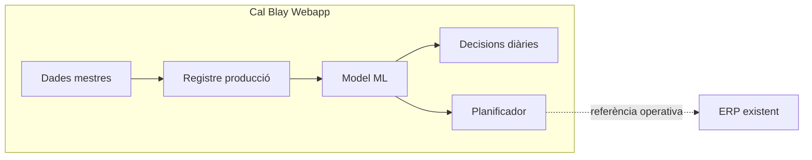

# Cuina central — Guia de funcionament

**Versió:** 1.0  
**Mòdul:** Cal Blay Webapp · Línia Bases (pilot)  
**Accés:** Només administradors (`role: admin`)

---

## 1. Propòsit del mòdul

El mòdul **Cuina central** planifica i optimitza la producció de **bases** (salses, sofregits i semielaborats per a plats finals) a la cuina central de Cal Blay.

No substitueix l’ERP: l’ERP continua controlant l’execució real de la producció, lots i separació per planificador. Aquest mòdul aporta:

- **Dades mestres** (articles, màquines, torns, rendiments teòrics).
- **Captura de producció real** per aprendre temps i rendiments.
- **Comparativa teòric vs realitat** amb aprenentatge continu (ML lleuger).
- **Planificació setmanal** amb capacitat finita i objectiu de minimitzar hores extra.
- **Informes diaris** per prendre decisions operatives.

---

## 2. Context de negoci

| Concepte | Descripció |
|----------|------------|
| **Bases** | Semielaborats (salses, sofregits) usats després en plats finals. |
| **Planificadors** | Tres línies generals demanen necessitats; a cuina central s’agrupen per produir i l’ERP separa per destí. |
| **Abast del mòdul** | Només **planificació i analítica** de capacitat de cuina (sense matèries primeres). |
| **Necessitats setmanals** | Introducció **manual** en unitat de mesura (kg, unitats, etc.). |

---

## 3. Submòduls i ús diari

| Submòdul | Ruta | Per a què serveix |
|----------|------|------------------|
| **Dades** | `/menu/cuina-central/dades` | Importar i mantenir catàleg, màquines, torns i rendiments teòrics. |
| **Producció** | `/menu/cuina-central/produccio` | Registrar al final del torn: article, màquina, quantitats, hores inici/fi, rebutjos, operaris. |
| **Decisions diàries** | `/menu/cuina-central/decisions` | Informe del dia: KPIs, alertes, teòric vs real, recomanacions. |
| **Informes** | `/menu/cuina-central/informes` | Anàlisi històrica per màquina, article, operari i model ML; export Excel. |
| **Planificador** | `/menu/cuina-central/planificador` | Necessitats setmanals → pla automàtic (editable) amb prediccions ML. |

### Flux operatiu recomanat

1. **Configuració inicial (una vegada):** Dades → importar articles/màquines/torns → definir rendiments teòrics (qty/h per màquina+article).
2. **Cada torn:** Producció → un o més registres per procés (pot durar diversos torns; ex. reducció 18 h).
3. **Cada matí:** Decisions diàries → revisar alertes i desviacions abans de planificar.
4. **Setmanalment:** Planificador → introduir necessitats i operaris per torn → generar pla → corregir si cal.

---

## 4. Dades mestres (submòdul Dades)

### 4.1 Articles (Bases)

- Codi i nom únics.
- Unitat de mesura (ex. kg, L, unitat).
- Embalatge (etiqueta fixa, ex. barqueta).
- Línia: `bases` (pilot).

### 4.2 Màquines

- Codi, nom, zona i ubicació.
- Coordenades opcionals al mapa (`mapX`, `mapY`) per visualització futura.
- Capacitat expressada com a **rendiment teòric** per article (no al doc de màquina sol).

### 4.3 Torns de producció

- Horari inici/fi (format `HH:mm`).
- Duració calculada en minuts (suporta torn que creua mitjanit).
- CRUD complet des de la interfície.

> **Nota:** Els torns d’esdeveniments (`/menu/torns`) són un mòdul diferent (personal d’esdeveniments). Aquí són **torns de producció** de cuina central.

### 4.4 Rendiment teòric (màquina × article)

- Exemple: bullidor → 400 kg/h per a un article concret.
- Base per comparar amb el rendiment **après** del model ML.

### 4.5 Importació Excel

- Format flexible: capçaleres en català/castellà (`codi`, `nom`, `unitat`, `maquina_codi`, `qty_h`, etc.).
- Mode incremental per defecte (actualitza per codi, crea nous).
- Plantilles: un full per tipus (articles, màquines, torns, rendiments).

---

## 5. Registre de producció (submòdul Producció)

### Camps obligatoris

| Camp | Descripció |
|------|------------|
| Article | Del catàleg importat. |
| Màquina | Equip on s’ha produït. |
| Quantitat produïda | En unitat de l’article. |
| Hora inici / Hora fi | Precisió a minuts; permet processos llargs (ex. 18 h). |

### Camps opcionals

- **Torn** de producció.
- **Rebutjos** (a part de la producció bona).
- **Operaris** (text, separats per coma; es detecten per informes).
- **Notes**.

### Què passa en desar

1. Es guarda el registre a Firestore.
2. Es crea/actualitza una **mostra d’aprenentatge** (id = id del registre).
3. Es **recalcula el model** del parell article+màquina.
4. Es **regenera l’informe diari** del dia de finalització.

El missatge de confirmació indica la **confiança del model** (`low` / `medium` / `high`) segons el nombre de mostres acumulades.

---

## 6. Aprenentatge continu (ML permanent)

El sistema **no es “tanca”**: cada registre nou refina les prediccions.

| Nivell | Significat |
|--------|------------|
| **Teòric** | Rendiment definit pel tècnic de processos (qty/h). |
| **Real / après** | Mitjana, mediana i EMA de minuts per unitat des de producció real. |
| **Eficiència** | `rendiment real / rendiment teòric` (per parell article·màquina). |
| **Confiança** | `low` (&lt;5 mostres), `medium` (5–19), `high` (≥20). |

### Predicció per planificar

Ordre de prioritat:

1. Model ML amb confiança suficient.
2. Barreja ML + teòric si hi ha poques mostres.
3. Només teòric si no hi ha històric.
4. Avís si no es pot estimar el temps.

---

## 7. Decisions diàries (submòdul Decisions)

Informe precomputat per **data** (`YYYY-MM-DD`):

- Nombre de registres, minuts totals, rebutjos.
- **Eficiència mitjana** del dia.
- **Alertes** (eficiència baixa, desviació &gt;15% respecte teòric).
- **Recomanacions** accionables (revisar processos, afinar temps estàndard, etc.).
- Taula **teòric vs real** per cada parell article·màquina actiu aquell dia.

**Acció especial:** «Recalcular ML (tot l’històric)» — reconstrueix mostres i models des de tots els registres de producció (útil després d’imports massius o correccions).

---

## 8. Informes (submòdul Informes)

| Pestanya | Contingut |
|----------|-----------|
| Eficiència article·màquina | Mètriques agregades del període filtrat. |
| Model ML | Teòric /h, predit /h, confiança, eficiència per parell. |
| Per màquina / article / operari | Resums de registres, minuts, quantitats. |
| Tendència | Evolució min/unitat per registre. |

Exportació **Excel** amb totes les capes.

---

## 9. Planificador setmanal (submòdul Planificador)

### Entrada

- **Setmana** (data del dilluns).
- **Operaris per torn** (nombre per cada torn de producció).
- **Necessitats:** llista article + quantitat + unitat.

### Sortida (generació automàtica)

- Graella: dia, torn, article, màquina, quantitat, minuts estimats.
- **Minimització d’hores extra:** reparteix càrrega en capacitat de torn × operaris.
- **Avisos** si no hi ha capacitat o falta rendiment per planificar.

### Després de generar

- El pla és **editable** (correccions manuals).
- Estat: esborrany / confirmat (persistit a Firestore).

---

## 10. Permisos i integracions

| Tema | Detall |
|------|--------|
| **Permisos** | Només `admin` veu el mòdul i pot cridar les APIs. |
| **ERP** | Fora d’abast v1; no duplica separació ni traçabilitat d’execució. |
| **Altres mòduls Cal Blay** | Mòdul ilot; integracions futures opcionals (lectura de necessitats des de ERP). |

---

## 11. Indicadors d’èxit del pilot (Bases)

- Millor **planificació** (menys hores extra, menys sobrecàrrega de màquines).
- Millor **eficiència** mesurable (teòric vs real estable i millorant amb el temps).
- Decisions diàries basades en **dades** en lloc de planificació «a cegues».

---

## 12. Documentació relacionada

- [Arquitectura tècnica del mòdul](./arquitectura-tecnica.md) — estructura de codi, APIs, Firestore i pipeline ML.
